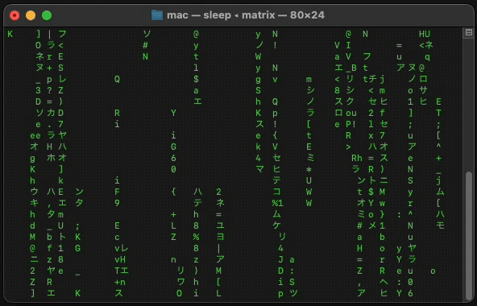

<div align="center">

<h1>Matrix Rain Terminal Effect 🌧️</h1>

<p>A sleek, Bash-based terminal Matrix rain effect with smooth animations and customizable character sets. Experience the iconic digital rain from The Matrix right in your terminal with minimal setup!</p>


<br>


</div>

## ✨ Features

- **Written in Bash:** Minimal dependencies; relies on standard Unix utilities (`stty`, `xargs`, `kill`, `sleep`, `wc`)
- **Smooth Animations:** Optimized raindrop rendering with configurable speeds
- **Mixed Character Sets:** Japanese katakana, numbers, symbols, and ASCII characters
- **Terminal Compatibility:** Works across most modern terminal emulators with ANSI and UTF-8 support
- **Responsive Design:** Automatically adapts to terminal size changes
- **Clean Exit:** Proper cleanup and signal handling
- **Lightweight:** Minimal resource usage

---

## 🚀 Quick Start

**Run instantly (no installation required):**
```sh
bash <(curl -s https://raw.githubusercontent.com/mohithn04/matrix/main/matrix)
```

**Or install locally:**
```sh
# Clone the repository
git clone https://github.com/mohithn04/matrix.git
cd matrix

# Make the script executable
chmod +x matrix.sh

# Run the effect
./matrix.sh
```
*You can also use the provided `matrix` executable after cloning or download it directly.*

---

## 💻 Requirements

- Bash 3.0+ (works with Bash 3 and 4+)
- Standard Unix utilities: `stty`, `xargs`, `kill`, `sleep`, `wc`
- Terminal emulator with ANSI escape sequence and UTF-8 support
- Unix/Linux/macOS environment

---

## 🎮 Usage

**Basic Usage**
```sh
./matrix.sh
```

**Exit the Effect**
- Press `Ctrl+C` to exit cleanly
- The script will restore your terminal settings automatically

---

## ⚠️ Notes & Compatibility

- While the script is written in Bash, it uses several standard Unix utilities and is not strictly "pure Bash."
- Requires a modern terminal emulator with ANSI and UTF-8 support (e.g., GNOME Terminal, Konsole, iTerm2, Terminal.app, Windows Terminal via WSL, Alacritty, Kitty).
- May not work correctly on minimal or legacy Unix systems missing required utilities, or in terminals lacking UTF-8/ANSI support.

---

## ⚙️ Customization

**Character Sets**
- The script uses a mix of characters defined in the `SYMBOLS` variable:
  ```
  SYMBOLS='アイウエオカキクケコサシスセソタチツテトナニヌネノハヒフヘホマミムメモヤユヨラリルレロワヲン0123456789!@#$%^&*()-_=+[]{}|;:,.<>?abcdefghijklmnopqrstuvwxyzABCDEFGHIJKLMNOPQRSTUVWXYZ'
  ```
- You can modify this for Japanese, numbers only, binary, or custom characters.

**Speed and Density**
- Adjust variables in the `rain()` function:
  - Raindrop spawn rate (`sleep 0.1`)
  - Individual drop speed (`sleep "0.0$dropSpeed"`)
  - Maximum concurrent drops (`local max_jobs=$((COLUMNS / 2))`)

**Colors**
- Currently uses green (Matrix-style). To add more colors, modify the `COLORS` array.

---

## 🔧 Technical Details

- **Terminal Initialization:** Switches to alternate screen buffer and hides cursor
- **Raindrop Generation:** Spawns background processes for each raindrop
- **Animation Loop:** Each raindrop renders characters moving down the screen
- **Job Control:** Manages background processes to prevent system overload
- **Signal Handling:** Proper cleanup on SIGINT, SIGTERM, and EXIT
- **Window Resize:** Handles terminal resize events (SIGWINCH)
- **Memory Efficient:** Uses background jobs instead of storing screen state

---

## 🐛 Troubleshooting

- **Characters not displaying correctly:**  
  Ensure your terminal supports UTF-8  
  ```
  export LANG=en_US.UTF-8
  export LC_ALL=en_US.UTF-8
  ```
- **Script doesn't exit cleanly:**  
  Force kill if needed  
  ```
  pkill -f matrix.sh
  ```
- **Performance issues:**  
  Reduce density by increasing sleep time (edit `sleep 0.1` to `0.2` or higher)

- **Debugging:**  
  Run with debug output:
  ```
  bash -x matrix.sh
  ```

---

## 🤝 Contributing

Contributions are welcome!  
1. Fork the repository
2. Clone your fork locally: `git clone https://github.com/YOUR_USERNAME/matrix.git`
3. Create your feature branch: `git checkout -b feature/amazing-feature`
4. Make your changes and test them
5. Commit your changes: `git commit -m 'Add amazing feature'`
6. Push to your fork: `git push origin feature/amazing-feature`
7. Open a Pull Request

**Ideas for Contributions:**
- Configuration file support
- Additional color schemes
- Sound effects integration
- Different rain patterns
- Interactive mode
- Windows PowerShell version

---

## 📜 License

This project is licensed under the MIT License. See the LICENSE file for details.

---

## 🙏 Support

If you find this project useful, please consider:
- ⭐ Starring this repository
- 🐛 Reporting bugs and issues
- 💡 Suggesting new features
- 🔄 Sharing with others

---

> "Welcome to the real world, Neo." – Morpheus

Made with ❤️ and Bash  
GitHub: [@mohithn04](https://github.com/mohithn04)
